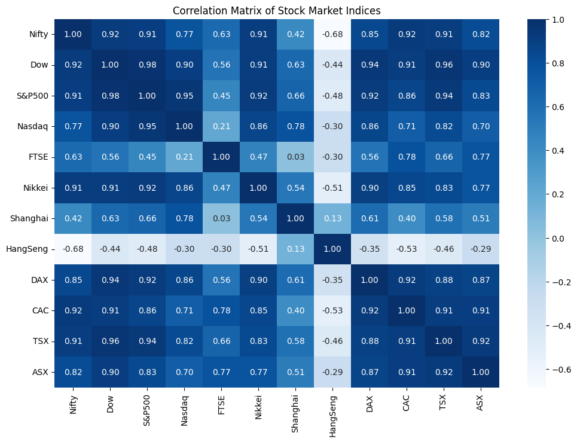
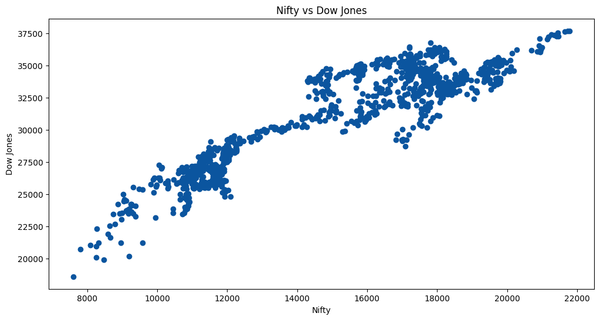
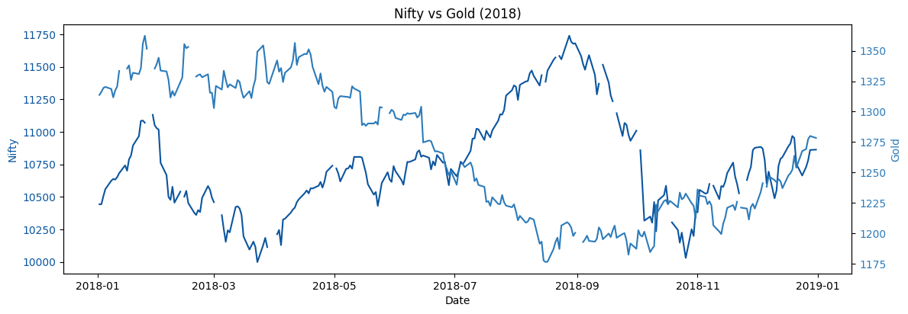
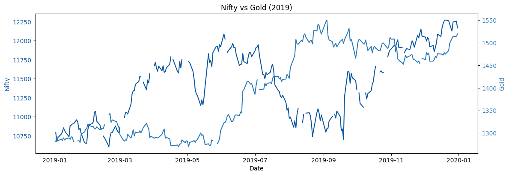
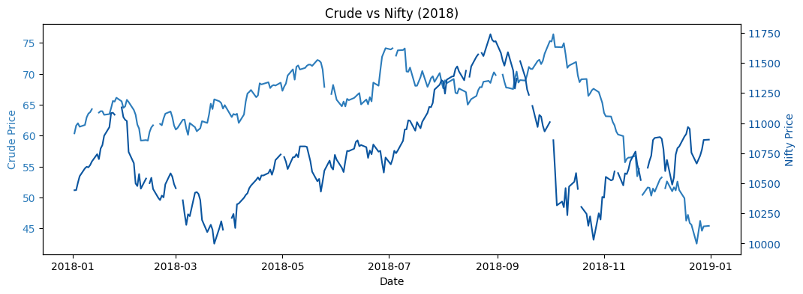
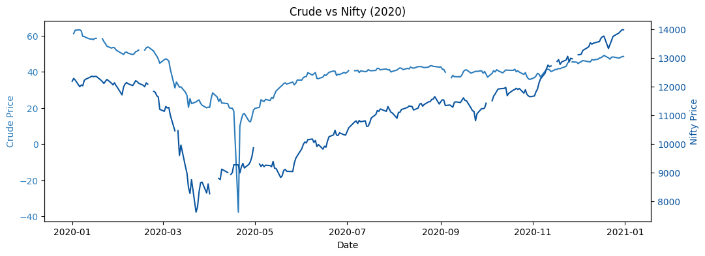
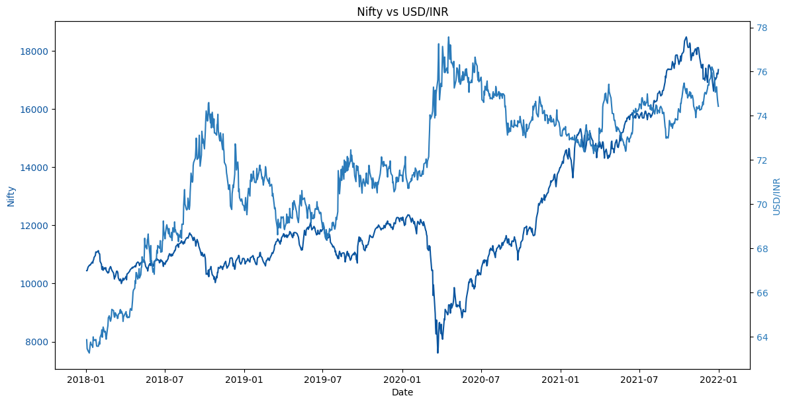

# INTERMARKET ANALYSIS: EXPLORING INDIAN STOCK MARKET'S CORRELATION WITH GLOBAL STOCKS, COMMODITIES, AND CURRENCIES

This project explores the relationships between the Indian stock market (Nifty) and major global indices, commodities, and currencies. The analysis uncovers patterns and correlations that influence market trends, offering insights for investors and analysts.

## Features
- **Global Indices Analysis**: Correlation between Nifty and major indices like Dow, S&P500, FTSE, etc.
- **Commodities Analysis**: Insights into Gold and Crude Oil trends in relation to Nifty.
- **Currency Analysis**: Study of USD/INR, EUR/USD, and other currency pairs against Nifty.
- **Data Visualization**: Heatmaps, scatter plots, and dual-axis line charts to illustrate relationships.

## Technologies Used
- **Python Libraries**:
  - `pandas` and `numpy` for data manipulation
  - `yfinance` for financial data retrieval
  - `matplotlib` and `seaborn` for visualization
- **Google Colab** for running the Python code

## Results

The following results were obtained from the project:

### 1. Graphical Representation:
- The following plots show the trends of different financial data over time:

### 2. Key Findings:

- **Global Indices & Indian Market**: The Indian market shows a strong correlation with global indices, particularly the US, indicating significant interconnectedness between markets.

- **Gold & Economic Uncertainty**: Gold and the Indian market both grow over time, but gold tends to surge during economic uncertainties, acting as a safe option when the equity market faces volatility.

- **Crude Oil & Economic Growth**: Crude oil lags behind market movements, serving as a key indicator of economic growth as demand for oil increases with economic expansion.

- **Currency Impact**: Currency fluctuations affect exports, imports, and investments, impacting the overall market sentiment and performance.

